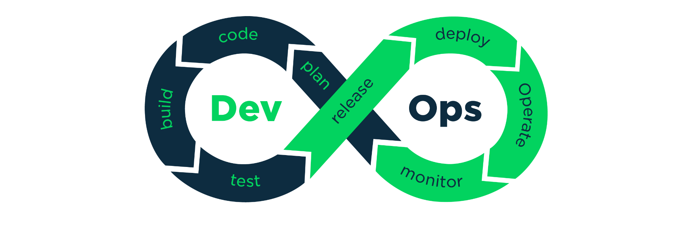
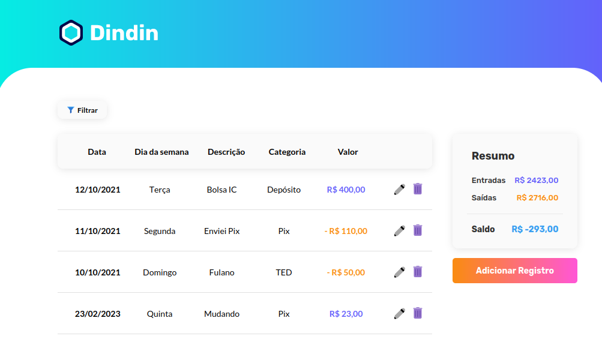
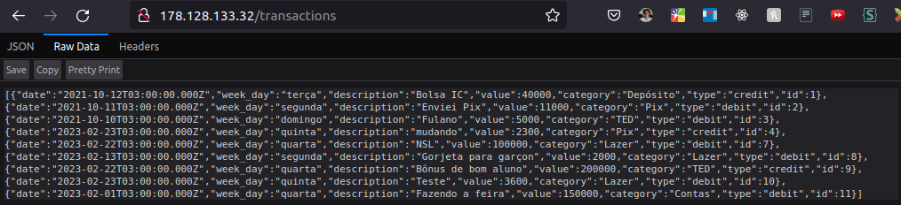

<h1 id="inicio" align="center">
  <br>
  
  <br>

Learning Devops

</h1>

Este projeto serve para reunir os estudos acerca dos fundamentos e tecnologias DevOps. Para centralizar todos os meus projetos, criei este repositório, que funciona como um hub para encontrar todos eles. Cada projeto está importado como um submódulo git.

Se você precisar clonar todos os submódulos referente aos projetos, você pode usar o comando git:

```bash
git submodule update --init --recursive
```

Ou se estiver somente olhando pelo GitHub web e quiser dar uma olhadinha nos projetos [clique aqui](projects)

## 🚀 Lista de projetos

### 1. Jornada DevOps de Elite


<details>
Este foi o meu primeiro contato de verdade com o DevOps, foi um evento que possibilitou o aprendizado da cultura DevOps, além da intrução diversas tecnologias fazendo um projeto do inicio ao fim. Tecnologias abordadas:

- 🐋 **Docker**: Containerização
- ☸️ **Kubernetes**: Orquestração
- 🇹 **Terraform**: Provisionamento
- 🕴️ **Jenkins**: Automação
- 📈 **Grafana**: Monitoramento
- 🔥 **Prometheus**: Métricas
</details>

Para ver o que foi abordado em cada aula, os arquivos e as docuentações do projeto [clique aqui](https://github.com/taffarel55/jornada-devops-elite)

### 2. Dindin 🚧 Em andamento 🚧


<details>

Utilizando os conhecimentos adquiridos na [Jornada DevOps de Elite](#1-jornada-devops-de-elite), decidi implantar um projeto simples que já havia desenvolvido anteriormente, composto por um frontend e um backend seguindo a topologia abaixo:

<h1 align="center">
  <br>
  
  <br>
</h1>

A ideia foi subir este projeto em um ambiente de produção. A seguir está a lista de coisas que fiz, aprendi e ainda pretendo fazer:

- 📃 **Código**:
  - Ajustes gerais código fonte
  - Mudança de endpoints caso esteja em _prod_
  - 🔜 Criação de testes unitários frontend
  - 🔜 Criação de testes unitários backend
-  **GitLab**:
  - Criação do projeto em outra plataforma
  - Utilização do registry
  - 🔜 Implementar pipeline de CI/CD
  - 🔜 Armazenar state do Terraform
-  **Docker**:
  - Dockerfile do backend
  - Dockerfile do frontend
  - Usei multi-stage build
  - Aprendizado de técnicas e boas práticas
  - Utilização do registry do gitlab
-  **Kubernetes**:
  - Gerenciamento de um cluster local
  - Gerenciamento de um cluster remoto
  - Práticas com os comandos `kubectl`
  - Utilização do `Deployment`
  - Utilização do `ReplicaSet`
  - Utilização do `Pod`
  - 🔜 Utilização do `Ingress`
  - 🔜 Utilização do `PersistentVolume`
  - 🔜 Utilização do `cert-manager`
  - 🔜 Utilização do `external-dns`
-  **Nginx**:
  - Configuração básica `nginx.conf`
  - Passar solicitação para proxy server
- 🌐 **Configuração de DNS**:
  - Apontar para nameservers
  - Adicionar registro A para criar um subdomínio
-  **Terraform**:
  - Utilização do Terraform para provisionar a infraestrutura
  - Leitura de documentação do Terraform
  - Terraform para a Digital Ocean
-  **Digital Ocean**:
  - Familiarização com o Cloud Provider
  - 🔜 Ver métricas no terminal web


> O DevOps é uma metodologia que visa a integração entre as equipes de desenvolvimento e operações de TI para que haja uma colaboração mais eficiente e um ciclo de desenvolvimento mais ágil. Nesse contexto, a importância de trabalhar em conjunto é fundamental para que a equipe consiga atingir seus objetivos com eficiência. Por isso, para este projeto, trabalhei em conjunto com outra pessoa [👥 @Fannine2](https://github.com/Fannine2/)

#### Printscreen do frontend:


#### Printscreen do backend:


#### `kubectl get all`:
```bash
❯ kubectl get all
NAME                                       READY   STATUS    RESTARTS   AGE
pod/backend-deployment-6c8c94bfc8-zzhsm    1/1     Running   0          34h
pod/frontend-deployment-75b99cdb4b-5xfch   1/1     Running   0          33h
pod/frontend-deployment-75b99cdb4b-7zl96   1/1     Running   0          33h
pod/frontend-deployment-75b99cdb4b-bpt2p   1/1     Running   0          33h

NAME                       TYPE           CLUSTER-IP      EXTERNAL-IP      PORT(S)        AGE
service/backend-service    ClusterIP      10.245.196.44   <none>           3333/TCP       2d4h
service/frontend-service   LoadBalancer   10.245.210.42   178.128.133.32   80:30000/TCP   2d4h
service/kubernetes         ClusterIP      10.245.0.1      <none>           443/TCP        2d4h

NAME                                  READY   UP-TO-DATE   AVAILABLE   AGE
deployment.apps/backend-deployment    1/1     1            1           2d4h
deployment.apps/frontend-deployment   3/3     3            3           2d4h

NAME                                             DESIRED   CURRENT   READY   AGE
replicaset.apps/backend-deployment-6c8c94bfc8    1         1         1       2d4h
replicaset.apps/frontend-deployment-75b99cdb4b   3         3         3       2d4h

```

> A aplicação também pode ser vista no seguinte endereço: http://dindin.taffarel.tech ou diretamente pelo IP: http://178.128.133.32
> Como eu não vou deixar no ar para não gastar dinheiro 💸, também tem as seguinte opções para consultar quando esses serviços não estiverem sidos mais disponíveis: https://web.archive.org/web/20230224052346/http://178.128.133.32/ https://web.archive.org/web/20230225160403/http://dindin.taffarel.tech/

</details>

Para ver o repositório no gitlab com uma documentação com mais detalhes [clique aqui](https://gitlab.com/it-study-group-br/finances)

<h2 id="contribuir">📫 Contribuindo para este repositório</h2>

Contribuições são o que tornam a comunidade de código aberto um lugar incrível para aprender, inspirar e criar. Todas as contribuições que você fizer são muito bem vindas!

Se quiser "fortalecer" aí sugerindo correções de texto e ortografia ou algum ajuste de código, pode abrir o pull request que vou amar!! :heart_eyes:

> Se tiver uma contribuição rápida que não envolve código, conteúdo ou quiser reportar algum problema sem ter que propor mudanças [clique aqui](https://github.com/taffarel55/devops-challenges/issues/new) para criar uma issue.

### Caso contrário, siga estes passos

1. Bifurque este repositório.
2. Crie um branch: `git checkout -b novoRecurso`.
3. Adicione suas edições para próximo commit: `git add .`
4. Faça suas alterações e confirme-as: `git commit -m 'Mensagem da sua contribuição'`
5. Especifique um novo repositório upstream remote que será sincronizado com a bifurcação: `git remote add upstream git@github.com:taffarel55/devops-challenges.git`
6. Envie para o branch original: `git push --set-upstream origin novoRecurso`
7. Crie a solicitação de pull através do link que aparecer no terminal.

### Muito complicado tudo que ta aí em cima?

Como alternativa do procedimento anterior, veja o passo a passo com imagens e explicações mais detalhadas de como propor mudanças:

1. [Como bifurcar e clonar um repositório Github](https://docs.github.com/pt/github/getting-started-with-github/quickstart/fork-a-repo)
2. [Como criar uma bifurcação para propor mudanças](https://docs.github.com/pt/pull-requests/collaborating-with-pull-requests/proposing-changes-to-your-work-with-pull-requests/creating-and-deleting-branches-within-your-repository)
3. [Como propor de mudança através de uma bifurcação](https://docs.github.com/pt/github/collaborating-with-pull-requests/proposing-changes-to-your-work-with-pull-requests/creating-a-pull-request-from-a-fork)

## 🤝 Pessoas colaboradoras

Agradecemos às seguintes pessoas que contribuíram para este projeto:

<table>
  <tr>
    <td align="center">
      <a href="https://github.com/taffarel55">
        <br>
        <sub>
          <b>Maurício Taffarel</b>
        </sub>
      </a>
    </td>
    <!--
    <td align="center">
      <a href="#">
        <br>
        <sub>
          <b>Mark Zuckerberg</b>
        </sub>
      </a>
    </td>
    <td align="center">
      <a href="#">
        <br>
        <sub>
          <b>Steve Jobs</b>
        </sub>
      </a>
    </td>
    -->
  </tr>
</table>

## 😄 Seja um das pessoas contribuidoras<br>

Quer fazer parte desse projeto e ajustar alguma ~~merda~~ besteira que eu escrevi? Proponha mudanças seguindo este [passo a passo](#contribuir). Fazer

Ah, fique a vontade para editar este `README.md` te adicionando à lista de pessoas contribuidoras.

## 📝 Licença

Esse projeto está sob licença. Veja o arquivo [LICENÇA](LICENSE) para mais detalhes.

[⬆ Voltar ao topo](#inicio)<br>
